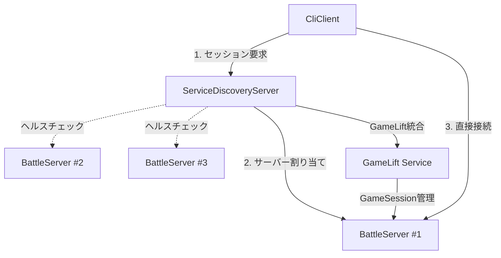

# サービスディスカバリーサーバー技術仕様

## 概要

InMemoryServerClientプロジェクトにおけるサービスディスカバリーサーバーは、バトルサーバーの検索・割り当て・管理を担当する中央制御システムです。GameLift統合とDirect接続の両方を透過的にサポートし、クライアントからはセッション管理の詳細を隠蔽します。

## アーキテクチャ概要

### システム全体構成



### 通信フロー

#### **統一フロー（GameLift/Direct共通）**
1. **クライアント → ServiceDiscoveryServer**: セッション作成要求
2. **ServiceDiscoveryServer**: 適切なBattleServerを選択・割り当て
3. **ServiceDiscoveryServer → クライアント**: BattleServer接続情報を返却
4. **クライアント → BattleServer**: 直接接続してバトル実行

#### **GameLiftモード時の追加フロー**
- ServiceDiscoveryServerがGameLift APIを呼び出してGameSession管理
- BattleServerの登録・ヘルスチェックもGameLift経由

#### **Directモード時の追加フロー**
- ServiceDiscoveryServerが内部でグループ管理
- BattleServerの登録・ヘルスチェックは直接通信

## サーバー仕様

### **ServiceDiscoveryServer**

#### **基本設定**
- **プロジェクト名**: `ServiceDiscoveryServer`
- **場所**: `csharp/src/ServiceDiscoveryServer/`
- **通信プロトコル**: SignalR (HTTP/1) + MagicOnion (HTTP/2)
- **ポート設定**:
  - SignalR: `5010`
  - MagicOnion: `5011`
  - Health Check: `5012`

#### **責任範囲**
- **セッション管理**:
  - グループ名ベースのGameSession作成・検索
  - セッション状態の追跡（Active/Completed/Terminated）
  - セッション有効期限管理
- **サーバー管理**:
  - 利用可能なBattleServerの登録・管理
  - サーバー負荷分散・割り当て
  - サーバーヘルスチェック・故障検出
- **GameLift統合**:
  - GameLift API経由でのGameSession管理（Anywhereモード）
  - Fleet管理・Compute管理
  - PlayerSession作成の代理実行
- **Direct接続サポート**:
  - インメモリでのグループ管理
  - BattleServerとの直接通信による状態同期

### **BattleServer（改修）**

#### **基本設定**
- **プロジェクト名**: `BattleServer` (InMemoryServerから改名)
- **場所**: `csharp/src/BattleServer/`
- **通信プロトコル**: SignalR (HTTP/1) + MagicOnion (HTTP/2)
- **ポート設定**: 動的割り当て（5000, 5001, 5002...）

#### **責任範囲**
- **バトル実行**: 既存のバトルロジックの実行
- **サーバー登録**: ServiceDiscoveryServerへの登録・ヘルスレポート
- **GameLift統合**: GameLift Server SDK統合（Anywhereモード時）
- **Direct接続**: ServiceDiscoveryServerとの直接通信（Directモード時）

## API仕様

### **ServiceDiscoveryServer API**

#### **SignalR Hub (`/discoveryHub`)**

```csharp
public class ServiceDiscoveryHub : Hub
{
    // セッション管理API
    Task<SessionCreationResponse> CreateOrFindSessionAsync(SessionCreationRequest request);
    Task<SessionInfo?> GetSessionInfoAsync(string sessionId);
    Task<IReadOnlyList<SessionInfo>> ListActiveSessionsAsync();
    Task<bool> TerminateSessionAsync(string sessionId);

    // サーバー管理API
    Task<IReadOnlyList<BattleServerInfo>> ListAvailableServersAsync();
    Task<BattleServerInfo?> GetAssignedServerAsync(string sessionId);

    // BattleServer用API
    Task<bool> RegisterServerAsync(BattleServerRegistration registration);
    Task<bool> UpdateServerStatusAsync(string serverId, BattleServerStatus status);
    Task UnregisterServerAsync(string serverId);
}
```

#### **MagicOnion Service**

```csharp
public interface IServiceDiscoveryService : IService<IServiceDiscoveryService>
{
    // セッション管理API
    UnaryResult<SessionCreationResponse> CreateOrFindSessionAsync(SessionCreationRequest request);
    UnaryResult<SessionInfo?> GetSessionInfoAsync(string sessionId);
    UnaryResult<IReadOnlyList<SessionInfo>> ListActiveSessionsAsync();
    UnaryResult<bool> TerminateSessionAsync(string sessionId);

    // サーバー管理API
    UnaryResult<IReadOnlyList<BattleServerInfo>> ListAvailableServersAsync();
    UnaryResult<BattleServerInfo?> GetAssignedServerAsync(string sessionId);

    // BattleServer用API
    UnaryResult<bool> RegisterServerAsync(BattleServerRegistration registration);
    UnaryResult<bool> UpdateServerStatusAsync(string serverId, BattleServerStatus status);
    UnaryResult<bool> UnregisterServerAsync(string serverId);
}
```

## データモデル

### **共有モデル**

```csharp
// セッション作成要求
public class SessionCreationRequest
{
    public string GroupName { get; set; } = string.Empty;
    public int MaxPlayers { get; set; } = 5;
    public SessionMode Mode { get; set; } = SessionMode.Auto; // Auto, GameLift, Direct
    public string? PreferredRegion { get; set; }
}

// セッション作成応答
public class SessionCreationResponse
{
    public bool IsSuccess { get; set; }
    public string? ErrorMessage { get; set; }
    public SessionInfo? Session { get; set; }
    public BattleServerConnectionInfo? ConnectionInfo { get; set; }
}

// セッション情報
public class SessionInfo
{
    public string SessionId { get; set; } = string.Empty;
    public string GroupName { get; set; } = string.Empty;
    public SessionMode Mode { get; set; }
    public SessionStatus Status { get; set; }
    public string AssignedServerId { get; set; } = string.Empty;
    public int CurrentPlayers { get; set; }
    public int MaxPlayers { get; set; }
    public DateTime CreatedAt { get; set; }
    public DateTime? CompletedAt { get; set; }

    // GameLiftモード時のみ
    public string? GameSessionId { get; set; }
    public string? FleetId { get; set; }
}

// BattleServer接続情報
public class BattleServerConnectionInfo
{
    public string ServerId { get; set; } = string.Empty;
    public string Address { get; set; } = string.Empty;
    public int SignalRPort { get; set; }
    public int MagicOnionPort { get; set; }
    public string SignalRHubPath { get; set; } = "/battlehub";
    public ConnectionType SupportedTypes { get; set; }
}

// BattleServer登録情報
public class BattleServerRegistration
{
    public string ServerId { get; set; } = string.Empty;
    public string Address { get; set; } = string.Empty;
    public int SignalRPort { get; set; }
    public int MagicOnionPort { get; set; }
    public int MaxConcurrentSessions { get; set; } = 3;
    public IReadOnlyList<string> SupportedModes { get; set; } = Array.Empty<string>();
    public IDictionary<string, object> Metadata { get; set; } = new Dictionary<string, object>();
}

// BattleServerステータス
public class BattleServerStatus
{
    public string ServerId { get; set; } = string.Empty;
    public ServerHealth Health { get; set; } = ServerHealth.Healthy;
    public int ActiveSessions { get; set; }
    public int MaxSessions { get; set; }
    public double CpuUsage { get; set; }
    public double MemoryUsage { get; set; }
    public DateTime LastHeartbeat { get; set; }
}

public enum SessionMode
{
    Auto,    // サーバーが最適なモードを選択
    GameLift, // GameLift Anywhereを強制使用
    Direct   // Direct接続を強制使用
}

public enum SessionStatus
{
    Creating,
    Active,
    InBattle,
    Completed,
    Terminated,
    Error
}

public enum ServerHealth
{
    Healthy,
    Degraded,
    Unhealthy,
    Unknown
}
```

## 設定仕様

### **ServiceDiscoveryServer設定**

```json
{
  "ServiceDiscovery": {
    "Server": {
      "SignalRPort": 5010,
      "MagicOnionPort": 5011,
      "HealthCheckPort": 5012,
      "AllowedOrigins": ["*"]
    },
    "Session": {
      "DefaultMaxPlayers": 5,
      "SessionTimeoutMinutes": 30,
      "CleanupIntervalMinutes": 5,
      "MaxConcurrentSessions": 100
    },
    "BattleServer": {
      "HeartbeatIntervalSeconds": 30,
      "HealthCheckTimeoutSeconds": 10,
      "UnhealthyThresholdCount": 3,
      "RemoveUnhealthyAfterMinutes": 5
    },
    "GameLift": {
      "Mode": "Auto", // "Disabled", "Auto", "Anywhere"
      "Anywhere": {
        "FleetId": "",
        "CustomLocation": "",
        "Region": "ap-northeast-1",
        "MaxGameSessionsPerFleet": 50
      },
      "AWS": {
        "Profile": "",
        "Region": "ap-northeast-1"
      }
    }
  },
  "Logging": {
    "LogLevel": {
      "Default": "Information",
      "ServiceDiscoveryServer": "Debug"
    }
  }
}
```

### **BattleServer設定追加**

```json
{
  "BattleServer": {
    "ServiceDiscovery": {
      "SignalREndpoint": "http://localhost:5010",
      "MagicOnionEndpoint": "http://localhost:5011",
      "RegistrationIntervalSeconds": 10,
      "HeartbeatIntervalSeconds": 30
    },
    "Server": {
      "SignalRPort": 0, // 0の場合は自動割り当て
      "MagicOnionPort": 0,
      "MaxConcurrentSessions": 3
    }
  }
}
```

## 実装計画

### **Phase 1: ServiceDiscoveryServer基盤構築**

#### **1.1 プロジェクト構造**

```
csharp/src/ServiceDiscoveryServer/
├── Http1Server/
│   ├── Hubs/
│   │   └── ServiceDiscoveryHub.cs
│   └── Extensions/
│       └── SignalRServiceExtensions.cs
├── Http2Server/
│   ├── Services/
│   │   └── ServiceDiscoveryService.cs
│   └── Extensions/
│       └── MagicOnionServiceExtensions.cs
├── Services/
│   ├── Core/
│   │   ├── ISessionManager.cs
│   │   ├── SessionManager.cs
│   │   ├── IBattleServerRegistry.cs
│   │   ├── BattleServerRegistry.cs
│   │   └── IGameLiftIntegration.cs
│   └── GameLift/
│       └── GameLiftSessionManager.cs
├── Models/
│   ├── Session/
│   │   ├── SessionModels.cs
│   │   └── SessionCreationModels.cs
│   └── Server/
│       ├── BattleServerModels.cs
│       └── ServerRegistrationModels.cs
├── Configuration/
│   └── ServiceDiscoveryOptions.cs
├── Extensions/
│   └── ServiceCollectionExtensions.cs
├── Program.cs
└── appsettings.json
```

#### **1.2 実装タスク**
1. **基盤インフラ構築**
   - ASP.NET Core + SignalR + MagicOnion設定
   - 設定システム（Options Pattern）
   - ログ設定・構造化ログ

2. **セッション管理サービス**
   - インメモリセッション管理
   - セッション状態遷移ロジック
   - セッションタイムアウト・クリーンアップ

3. **BattleServerレジストリ**
   - サーバー登録・登録解除
   - ヘルスチェック・ハートビート管理
   - 負荷分散アルゴリズム

### **Phase 2: GameLift統合**

#### **2.1 GameLift統合サービス**
```csharp
public class GameLiftSessionManager : IGameLiftIntegration
{
    Task<SessionCreationResponse> CreateGameLiftSessionAsync(SessionCreationRequest request);
    Task<SessionInfo?> GetGameLiftSessionAsync(string sessionId);
    Task<bool> TerminateGameLiftSessionAsync(string sessionId);
    Task<IReadOnlyList<SessionInfo>> ListGameLiftSessionsAsync();
}
```

#### **2.2 実装タスク**
1. **GameLift API統合**
   - CreateGameSession API呼び出し
   - DescribeGameSessions API呼び出し
   - CreatePlayerSession API代理実行

2. **Fleet管理**
   - 利用可能Fleet検索
   - Fleet容量監視
   - 自動スケーリング対応

### **Phase 3: BattleServer改修**

#### **3.1 ServiceDiscovery統合**
```csharp
public class ServiceDiscoveryClient : IHostedService
{
    Task RegisterAsync();
    Task SendHeartbeatAsync();
    Task UpdateStatusAsync(BattleServerStatus status);
    Task UnregisterAsync();
}
```

#### **3.2 実装タスク**
1. **サーバー登録機能**
   - 起動時の自動登録
   - 設定情報の送信
   - サーバーID管理

2. **ヘルスレポート**
   - 定期ハートビート送信
   - リソース使用率レポート
   - セッション状態レポート

### **Phase 4: Client統合**

#### **4.1 Client改修**
```csharp
public class ServiceDiscoveryClientProvider : IBattleClientProvider
{
    Task<SessionCreationResponse> CreateSessionAsync(string groupName);
    Task<BattleServerConnectionInfo> GetServerConnectionAsync(string sessionId);
    Task<IHubConnection> ConnectToBattleServerAsync(BattleServerConnectionInfo connectionInfo);
}
```

#### **4.2 実装タスク**
1. **ServiceDiscovery通信**
   - セッション作成要求
   - サーバー情報取得
   - 接続先解決

2. **BattleServer接続**
   - 動的接続先変更
   - 接続エラーハンドリング
   - 再接続ロジック

## 負荷分散・可用性

### **サーバー選択アルゴリズム**

#### **1. ラウンドロビン（デフォルト）**
```csharp
public BattleServerInfo? SelectServer(IReadOnlyList<BattleServerInfo> availableServers)
{
    return availableServers
        .Where(s => s.Health == ServerHealth.Healthy)
        .OrderBy(s => s.ActiveSessions)
        .FirstOrDefault();
}
```

#### **2. 負荷ベース選択**
```csharp
public BattleServerInfo? SelectServerByLoad(IReadOnlyList<BattleServerInfo> availableServers)
{
    return availableServers
        .Where(s => s.Health == ServerHealth.Healthy)
        .OrderBy(s => s.LoadScore) // CPU + Memory + Sessions
        .FirstOrDefault();
}
```

### **高可用性設計**

#### **1. ServiceDiscoveryServer冗長化**
- 複数インスタンスでの実行
- Redis/Hazelcastによる状態共有
- ロードバランサーによる負荷分散

#### **2. BattleServer故障対応**
- ヘルスチェック故障検出
- 自動的なサーバー除外
- セッション移行（将来実装）

## セキュリティ考慮事項

### **1. 認証・認可**
- JWT認証によるクライアント認証
- BattleServer登録時の認証
- API呼び出し時の権限チェック

### **2. 通信セキュリティ**
- HTTPS/WSS通信の強制
- CORS設定による制限
- Rate limiting実装

### **3. GameLift統合セキュリティ**
- AWS IAMロールによる認証
- 最小権限の原則適用
- アクセスキー管理の統一

## 監視・運用

### **1. メトリクス**
- セッション作成・完了数
- BattleServer登録・除外数
- レスポンス時間
- エラー発生率

### **2. ログ**
- 構造化ログによる出力
- セッションライフサイクル追跡
- BattleServer状態変更追跡
- GameLift API呼び出し追跡

### **3. ヘルスチェック**
- `/health` エンドポイント
- 依存サービス接続チェック
- リソース使用率チェック

## 移行戦略

### **1. 段階的移行**
1. ServiceDiscoveryServer導入
2. BattleServer改修・ServiceDiscovery統合
3. Client改修・新フロー対応
4. 既存Direct接続の段階的移行

### **2. 後方互換性**
- 既存のDirect接続API維持
- 設定による移行制御
- 段階的な機能切り替え

### **3. テスト戦略**
- ServiceDiscoveryServerの単体テスト
- BattleServerとの統合テスト
- Client-ServiceDiscovery-BattleServerのE2Eテスト
- GameLift統合テスト

この仕様により、スケーラブルで可用性が高く、GameLiftとDirect接続を透過的に扱えるサービスディスカバリーシステムを構築します。
